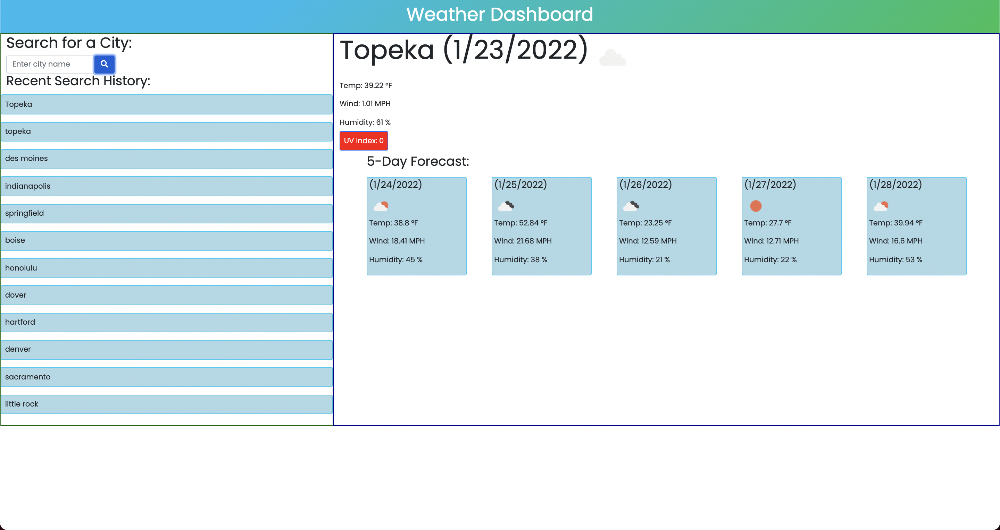

# weather-dashboard

### Description
Weather-Dashboard is a web application to find weather conditions of a given city as well as the city's 5-day forecast.

The server-side API used to get response data object is retrieved from the Open Weather APi.
The current weather section is including the following weather characters and date.

- City, Date, Icon-image
- Temperature
- Humidity
- Wind Speed
- UV index

The 5-days weather forecast also displays below the current weather conditions section and it includes the following information for each day:

- Date
- Icon image
- Temperature
- Humidity

## Features

- HTML
- CSS
- Bootstrap
- Server-Side API - OpenWeather API

## Screenshot

